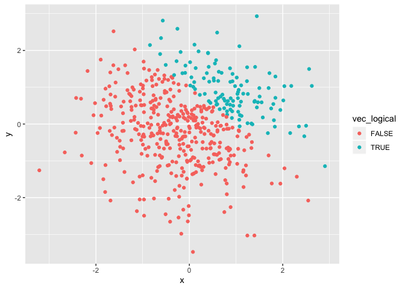
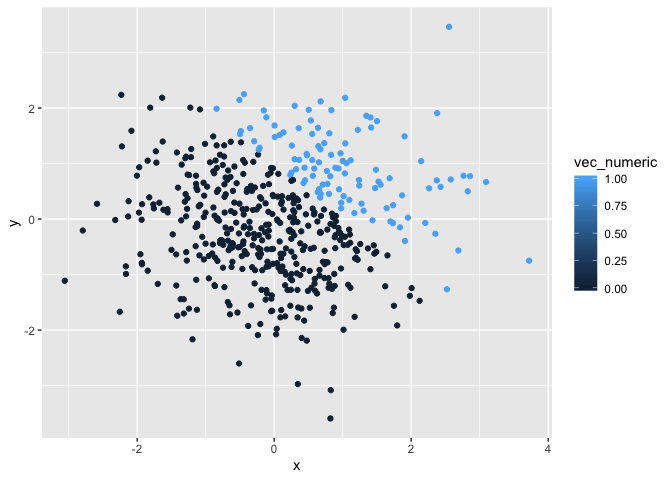

p8105\_hw1\_qz2392
================
Qimin Zhang
9/13/2019

# Problem 1

First to include the library “tidyverse”.

``` r
library(tidyverse)
```

Then to create the required dataframe.

``` r
df_1= tibble(
  vec_numeric = rnorm(8),
  vec_logical = vec_numeric > 10,
  vec_char = c("This", "is", 
               "Qimin", "Zhang",
               "welcome","to",
               "my","rmarkdown"),
  vec_factor = factor(c("small", "small", 
                        "small","medium", 
                        "medium","medium",
                        "large","large"))
)
```

Take the mean of each variable.

``` r
df_1 %>% pull(vec_numeric) %>% mean()
## [1] -0.1749911
df_1 %>% pull(vec_logical) %>% mean()
## [1] 0
df_1 %>% pull(vec_char) %>% mean()
## Warning in mean.default(.): argument is not numeric or logical: returning
## NA
## [1] NA
df_1 %>% pull(vec_factor) %>% mean()
## Warning in mean.default(.): argument is not numeric or logical: returning
## NA
## [1] NA
```

According to the output, we can take means of numerical variables and
logical variables, but we can’t do so to character variables and factor
variables.

Try to convert variables to numeric:

``` r
df_1 %>% pull(vec_logical) %>% as.numeric()
df_1 %>% pull(vec_char) %>% as.numeric()
df_1 %>% pull(vec_factor) %>% as.numeric()
```

Logical variables and factor variables can be converted to numerical,
but character variables can’t be. Because in R, if we do numerical
calculation to logical and factor variables, they are automatically
turned into numerical form which still represents specific categories,
while character variables can’t be. It explains why we can take mean of
logical variables, but can’t explain why we can’t do so to factor
variables.

The following is to convert logical variables to different types, then
multiply the results by random samples.

``` r
(df_1 %>% 
  pull(vec_logical) %>% 
  as.numeric()) *pull(df_1, vec_numeric)
## [1] 0 0 0 0 0 0 0 0
(df_1 %>% 
  pull(vec_logical) %>% 
  as.factor()) *pull(df_1, vec_numeric)
## Warning in Ops.factor((df_1 %>% pull(vec_logical) %>% as.factor()),
## pull(df_1, : '*' not meaningful for factors
## [1] NA NA NA NA NA NA NA NA
(df_1 %>% 
  pull(vec_logical) %>% 
  as.factor() %>% 
  as.numeric()) *pull(df_1, vec_numeric)
## [1]  2.0643287 -2.6098854  1.2705971  0.1810034 -0.2891182 -1.7956488
## [7] -1.1058570  0.8846516
```

It doesn’t work when converting logical variables to factor ones.

# Problem 2

First to create the required dataframe.

``` r
df_2= tibble(
  x = rnorm(500),
  y = rnorm(500),
  vec_logical = x+y>1,
  vec_numeric = as.numeric(vec_logical),
  vec_factor = as.factor(vec_logical)
)
```

Get some descriptive statistics of the variables above. Number of
columns of the dataframe is 5, while number of rows of the dataframe is
500. Mean of x in dataframe is 0.0138308. Median of x in dataframe is
0.0185239. Standard deviation of x in dataframe is 1.0540466.
Proportions of the vec\_logicals which are True are 0.214.

Make scatterplots of y vs x with different color scale and save them:

``` r
ggplot(df_2, aes(x = x, y = y, color = vec_logical)) + geom_point()
```

<!-- -->

``` r
ggsave("scatterplot with logical scale.png")
```

``` r
ggplot(df_2, aes(x = x, y = y, color = vec_numeric)) + geom_point()
```

<!-- -->

``` r
ggsave("scatterplot with numeric scale.png")
```

``` r
ggplot(df_2, aes(x = x, y = y, color = vec_factor)) + geom_point()
```

<!-- -->

``` r
ggsave("scatterplot with factor scale.png")
```

When using color to seperate the scatter points, the color scale is
binary with logical and factor variables, while it’s continuous with
numeric variables.
