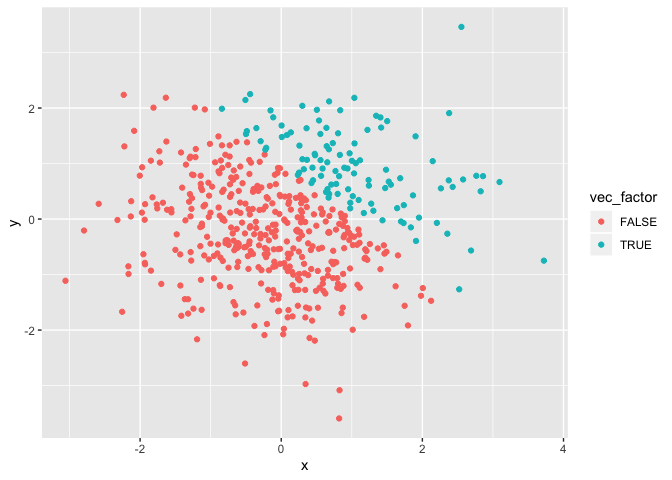
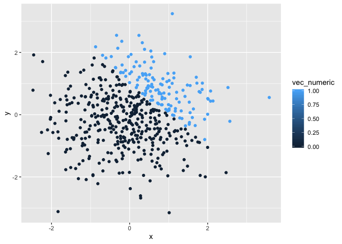
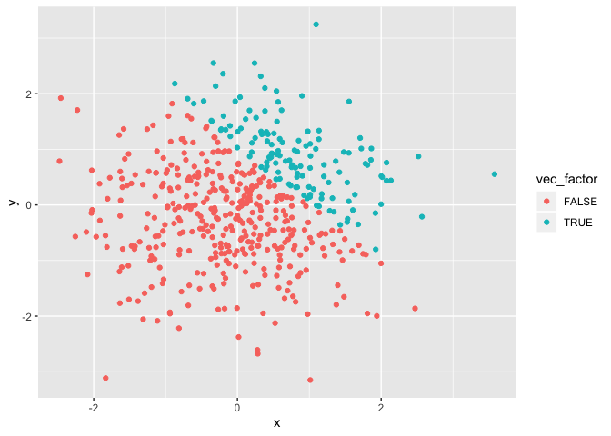

p8105\_hw1\_qz2392
================
Qimin Zhang
9/13/2019

# Problem 1

First to include the library “tidyverse”.

``` r
library(tidyverse)
```

Then to create the required dataframe.

``` r
df_1= tibble(
  vec_numeric = rnorm(8),
  vec_logical = vec_numeric > 10,
  vec_char = c("This", "is", "Qimin", "Zhang","welcome","to","my","rmarkdown"),
  vec_factor = factor(c("small", "small", "small","medium", "medium","medium","large","large"))
)
```

Take the mean of each variable.

``` r
mean(pull(df_1, vec_numeric))
mean(pull(df_1, vec_logical))
mean(pull(df_1, vec_char))
```

    ## Warning in mean.default(pull(df_1, vec_char)): argument is not numeric or
    ## logical: returning NA

``` r
mean(pull(df_1, vec_factor))
```

    ## Warning in mean.default(pull(df_1, vec_factor)): argument is not numeric or
    ## logical: returning NA

According to the output, we can take means of numerical variables and
logic variables, but we can’t do so to character variables and factor
variables.

Try to convert variables to numeric:

``` r
as.numeric(pull(df_1, vec_logical))
as.numeric(pull(df_1, vec_char))
as.numeric(pull(df_1, vec_factor))
```

Logical variables and factor variables can be converted to numerical,
but character variables can’t be. It explains why we can take mean of
logical variables, but can’t explain why we can’t do so to factor
variables.

The following is to convert logical variables to different types, then
multiply the results by random
    samples.

``` r
as.numeric(pull(df_1, vec_logical))*pull(df_1, vec_numeric)
```

    ## [1] 0 0 0 0 0 0 0 0

``` r
as.factor(pull(df_1, vec_logical))*pull(df_1, vec_numeric)
```

    ## Warning in Ops.factor(as.factor(pull(df_1, vec_logical)), pull(df_1,
    ## vec_numeric)): '*' not meaningful for factors

    ## [1] NA NA NA NA NA NA NA NA

``` r
as.numeric(as.factor(pull(df_1, vec_logical)))*pull(df_1, vec_numeric)
```

    ## [1]  1.3380060  1.9677984  0.2565417  1.1325480 -1.6156520 -0.6718556
    ## [7]  0.3941170  1.8846602

# Problem 2

First to create the required dataframe.

``` r
df_2= tibble(
  x = rnorm(500),
  y = rnorm(500),
  vec_logical = x+y>1,
  vec_numeric = as.numeric(vec_logical),
  vec_factor = as.factor(vec_logical)
)
```

Get some descriptive statistics of the variables above.

``` r
#Number of columns of the dataframe
ncol(df_2)
```

    ## [1] 5

``` r
#Number of rows of the dataframe
nrow(df_2)
```

    ## [1] 500

``` r
#Mean of x in dataframe
mean(pull(df_2, x))
```

    ## [1] 0.05444978

``` r
#Median of x in dataframe
median(pull(df_2, x))
```

    ## [1] 0.08236661

``` r
#Standard deviation of x in dataframe
sd(pull(df_2, x))
```

    ## [1] 0.9555884

``` r
#Proportion of the vec_logicals which are true
prop.table(table(pull(df_2, vec_logical)))
```

    ## 
    ## FALSE  TRUE 
    ## 0.736 0.264

Include the library “ggplot2”.

``` r
library(ggplot2)
```

Make a scatterplot of y vs x:

``` r
ggplot(df_2, aes(x = x, y = y, color = vec_logical)) + geom_point()
```

<!-- -->

``` r
ggplot(df_2, aes(x = x, y = y, color = vec_numeric)) + geom_point()
```

<!-- -->

``` r
ggplot(df_2, aes(x = x, y = y, color = vec_factor)) + geom_point()
```

<!-- -->
